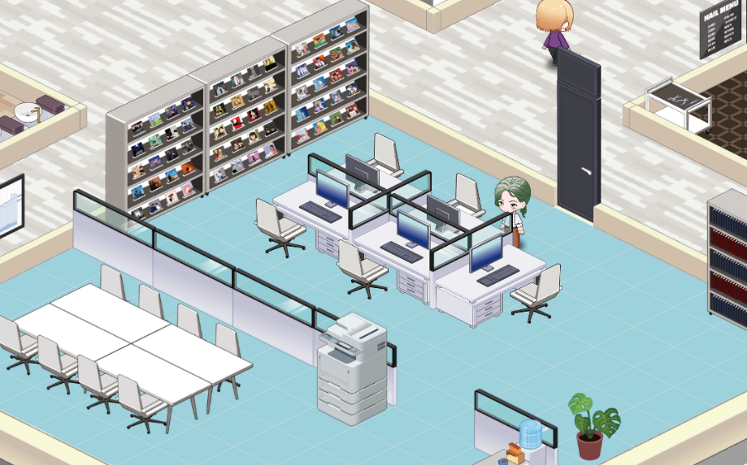

# My Little Company

## 🛠️ Technical Highlights

### 🏗️ Custom Isometric Engine

> **"Unity Tilemap의 한계를 극복한 렌더링 최적화 및 공간 제어 솔루션"**  
> <kbd>Mathematical Mapping</kbd> <kbd>Dependency Ordering</kbd> <kbd>Spatial Re-parenting</kbd>

#### 🟦 The Logic: OrderTree System

* 타일 경계 오차(Jittering)를 제거하기 위한 수학적 격자 세분화(Subdivision) 판정 설계.
* 객체 간 가림 관계(occlusion)를 기반으로 공간적 의존성을 구성하여 렌더링 순서를 결정.
* 객체 상태 변경 시 전체 구조를 재계산하지 않고 영향 범위만 재구성하는 Spatial Re-parenting 트리 설계.

#### 🟩 RESULT (Performance)

* 의존성 기반 트리 구조를 통해 전체 재정렬 없이 평균 `O(N log N)` 수준의 정렬 성능 확보.
* 3,600개 오브젝트 스트레스 테스트 환경에서 인게임 Micro-stuttering 없이 안정적인 60 FPS 유지.

### 🤝 YAML Scene Change Tracker

> **Unity Scene YAML 분석 기반의 오브젝트 단위 변경 추적 시스템**  
> <kbd>YAML Parsing</kbd> <kbd>Hierarchy Restoration</kbd> <kbd>Regex Matching</kbd> <kbd>Workflow Optimization</kbd>

#### 🟦 Core Logic: Object-Level Tracking

* 씬 파일을 Unity 내부 ID 기반 오브젝트 블록으로 분해하여 정밀 데이터를 추출.
* 씬 계층 구조를 복원하여 상위 노드 변경 시 하위 노드 중복 알림을 방지하는 필터링 로직 구현.
* 프리팹 인스턴스와 내부 컴포넌트 수정까지 추적하여 실제 영향 범위와 변경 전파 관계 분석 지원.

#### 🟩 RESULT (Impact)

* 커밋 전 객체 단위 검토로 충돌을 예방하고, 충돌 발생 시 직관적인 리포트로 신속한 해결 지원.
* 오브젝트 수정 내역을 시각화하여 씬 병합 및 코드 리뷰 과정의 신뢰도와 작업 속도를 획기적으로 개선.

---

## Project Overview

**상업 프로젝트 'My Little Company'의 클라이언트 핵심 시스템 설계 및 최적화**

| **Screenshot** | **Information** |
| :--- | :--- |
|  | **Genre**   2D 경영 시뮬레이션    **Period**   2024.10 - 2025.10 (상업 프로젝트)    **Team**   10인 (클라 3, 서버 1, 기획 1, 아트 4, 사운드 1)    **Role**   클라이언트 핵심 시스템 및 로비 시스템 설계/구현 |

### 🛠️ Key Responsibilities

#### Core Systems & Optimization

- Isometric World System: 의존성 트리 정렬 및 수학적 격자 분할 기반 쿼터뷰 최적화 렌더링 엔진 구축.
- Simulation & Content: 아이템 생산, 직원 배치 등 데이터 기반 핵심 비즈니스 로직 및 사무실 운영 시스템 구현.
- Character Intelligence: A* 경로 탐색 및 상태 표현(이모지/말풍선)을 포함한 시간 기반 행동 제어 시스템 구현.
- Environment Systems: URP Lighting을 활용한 실시간 낮/밤 시간대 전환 시스템 구현.

#### Development Workflow & Tools

- Scene Management Tool: Unity YAML 파싱 기반 오브젝트 단위 변경 이력 추적 도구 자체 개발.
- VCS Management: Git 기반 협업 환경에서 메인테이너로서 씬 충돌(Merge Conflict) 관리 및 병합 프로세스 전담.

---

## 🏗️ Custom Isometric Engine

### ⚠️ Limitations of Unity Tilemap (Why Custom System?)

Unity Tilemap의 Y-Sorting 방식은 단일 Pivot 값을 기준으로 렌더링 순서를 결정하기 때문에,  
N x M 크기를 점유하는 다중 타일 객체 환경에서는 정확한 렌더링 우선순위를 판별하지 못하는 구조적 한계가 존재합니다.  
특히 객체들이 복잡하게 배치될 경우 렌더링 순서가 뒤틀리거나 가려짐 관계가 역전되는 정렬 꼬임 현상이 발생합니다.  

이를 해결하기 위해 객체 간 공간적 선후 관계(Spatial Dependency)에 기반한 독자적인 정렬 시스템을 설계했습니다.

  

### 📐 Coordinate Conversion & Precision Strategy

일반적인 역행렬-Round 방식은 부동소수점 오차로 인해 타일 경계에서 좌표가 튀는 지터링 현상을 유발합니다.  
특히 캐릭터 이동 시 타일 경계에서 미세한 오차로 인해 렌더링 순서가 깜빡이는 현상이 발생합니다.  
이에 타일 영역을 수학적으로 세분화하는 '삼각 영역 판별법'을 도입하여 수치적 안정성과 정밀도를 확보했습니다.

- Step 1. 격자 세분화: 월드 공간을 half-tile 단위의 직교 그리드로 분할합니다.
- Step 2. 영역 판정: 직선 방정식 `Ax + By + C > 0`을 활용하여 좌표가 속한 삼각형 영역을 판정합니다.
- Step 3. 좌표 복원: 판정된 구역의 상대적 위치 정보를 기반으로 최종 타일 인덱스($x, y$)를 도출합니다.

  

### 🧱 Tile Entity Base: Multi-Tile Occupancy

TileObject는 타일 기반 환경에서 모든 인게임 객체를 표현하는 기본 엔티티 단위입니다.  
객체 내부의 Pivot을 기준으로 점유 영역을 정밀하게 조정하여 Sprite와 논리 데이터 간의 시각적 불일치를 해소하고,  
격자 배치 및 Flip 기반 데이터 동기화 로직을 캡슐화하여 상위 시스템의 제어 무결성을 확보했습니다.

#### Derived Classes: Entity Variations

TileObject를 상속받아 각 객체의 특성에 맞는 기능을 확장한 파생 클래스 목록입니다.

| 파생 클래스 | 주요 역할 및 특징 |
| :--- | :--- |
| **TileFrame** | 사무실 영역 해금 및 확장을 위한 임시 배치용 정적 프레임 객체 |
| **TileOffice** | 직원 배치 및 아이템 생산 등 실질적인 인게임 비즈니스 로직을 처리하는 데이터 관리 객체 |
| **TileCharacter** | A* 알고리즘 기반의 실시간 경로 탐색 및 타일 점유 갱신을 수행하는 동적 상호작용 객체 |

#### Productivity Enhancement: Custom Editor & Visual Debugging

직관적인 Isometric 오브젝트 배치를 위해 Custom Inspector 및 시각적 디버깅 도구를 구축해 작업 효율을 향상시켰습니다.

- Visual Debugging (Gizmos): `OnDrawGizmos`를 통해 논리적 점유 영역과 Sprite 기준의 가상 영역을 각각 시각화합니다.
- One-Click Position Snap: Scene 뷰에서 객체를 단일 클릭으로 격자에 정밀하게 안착시키는 에디터 기능을 구현했습니다.

  
  

### 🌲 Render Ordering System: Dependency-Based OrderTree

OrderTree는 Unity Tilemap의 정렬 한계를 극복한 Isometric 렌더링 솔루션입니다.  
다중 타일 정렬 문제를 해결하기 위해 단순 값 비교 대신 공간적 선후 관계 기반 비교 알고리즘을 사용하며,  
의존성 기반 트리 구조를 통해 변경 영역만 국소 갱신하여, 대규모 객체 환경에서도 안정적인 렌더링 순서를 보장합니다.

#### CompareOrder: Relative Ordering Mechanism

CompareOrder는 의존성 트리를 구성하기 위한 가장 기초적인 연산 단위로,  
두 객체의 Tile-Space Bounding Box를 비교하여 상대적인 렌더링 순서를 판별합니다.  
객체의 최소 좌표(head)와 최대 좌표(tail)를 기준으로 CompareOrder(A, B)는 다음 값을 반환하며,  
명확한 선후 관계를 판별할 수 없는 경우에는 무리하게 순서를 결정하지 않고 오더 관계 없음(0)으로 처리합니다.  

-  1 → A가 B보다 나중에 렌더링 되어야 함.  
- -1 → B가 A보다 나중에 렌더링 되어야 함.  
-  0 → 두 객체 간에 명확한 렌더링 선후 관계가 없음.

  

#### AddNode: Local Dependency Resolution

AddNode는 복잡한 오더 관계를 트리 구조로 근사(Tree Approximation)하는 핵심 삽입 알고리즘입니다.  
미리 정렬된 리스트를 탐색하여 가장 적절한 부모를 O(N) 비용으로 탐색하며, 다음과 같이 동작합니다.

- Parent Search: 계층적으로 정렬된 리스트를 역순으로 탐색하여 가장 계층적으로 가까운 노드를 부모로 선택합니다.
- Local Re-parenting: 리스트를 순회하여, 새 노드를 통해 의존 경로를 단순화할 수 있는 노드를 재부모화합니다.
- Hierarchical Propagation: 부모 노드를 기준으로 Level 및 Sorting Order를 재귀 전파하여 계층 데이터를 갱신합니다.

  

#### Advanced Ordering Strategies: Range & Cached Paths

- Order Range  
  여러 객체가 동일 타일 영역을 공유하는 경우에는 range 기반의 지역 오더(Local Ordering) 방식을 사용합니다.  
  사무실 내부의 가구나 방문 캐릭터 등은 사무실 객체에 종속되어, order range 내에서 순차적으로 오더를 할당받습니다.

- Cached Path  
  캐릭터와 같은 동적 객체는 이동마다 order를 재계산하지 않고, 경로(Path Node)의 order 정보를 캐싱하여 사용합니다.  
  여러 캐릭터가 동일 좌표를 공유하는 경우에는 range 내에서 순차적으로 오더를 분배합니다.

- Character Visit  
  캐릭터는 일반적으로 Path Node의 cached order를 사용하지만, 사무실 내부에 진입하면 내부 오더 규칙으로 전환됩니다.  
  사무실 객체는 배경-가구-캐릭터의 레이어 구조를 구성하여 range 내의 오더를 분배합니다.
  

  

#### Performance Analysis: OrderTree vs. List.Sort

소규모 환경(34개 오브젝트)과 대규모 스트레스 테스트 환경(3,600개+ 오브젝트)에서 두 방식의 실행 속도를 비교한 결과입니다.

| Metric | List.Sort (34) | OrderTree.AddNode (34) | List.Sort (3600+) | OrderTree.AddNode (3600+) |
| :--- | :--- | :--- | :--- | :--- |
| 평균 실행시간 | 0.169 ms | 0.04 ms | 6,593.0 ms | 0.086 ms |
| 최대 실행시간 | - | 1.1687 ms | - | 1.3451 ms |
| 최소 실행시간 | - | 0.0016 ms | - | 0.0008 ms |

- Experiment Setup  
  List.Sort는 모든 오브젝트가 이미 존재하는 상태에서 전체 정렬을 수행하는 방식으로 측정했습니다.  
  OrderTree.AddNode는 빈 상태에서 오브젝트를 하나씩 추가하며 트리를 구성하는 방식으로 측정했습니다.  

- Result Summary  
  소규모 환경에서는 전체 실행시간 총합 기준으로 List.Sort(0.169ms), AddNode(1.36ms)로 List.Sort가 더 빠른 성능을 보였습니다.  
  그러나 대규모 환경에서는 List.Sort(6,593ms), AddNode(309.6ms)로 객체 수가 증가할수록 성능 격차가 급격히 확대되었습니다.

- Runtime Characteristics  
  List.Sort는 오브젝트 변경 시마다 전체 정렬을 반복하는 반면, AddNode는 단일 삽입 비용만 발생합니다.  
  예를 들어 대규모 환경에서 오브젝트 변경이 3회 발생하면, List.Sort(19,779ms), AddNode(0.258ms)로 격차가 극적으로 확대됩니다.  
  이는 OrderTree가 실제 게임 환경에서 높은 구조적 확장성을 유지할 수 있는 핵심 요인입니다.

#### Architectural Evolution : 알고리즘 발전 과정 및 시행착오

- 초기 시도. 전수 조사 정렬 (Brute-force)  
  🟦 매 프레임 모든 객체 간의 전후 관계를 전수 조사하여 정렬을 수행했습니다.  
  🟥 객체 수 증가에 따라 연산량이 급격히 증가하며 심각한 프레임 드랍이 발생했습니다.

- 1차 개선. 조건적 전수 조사 정렬 (Incremental Brute-force)  
  🟦 오브젝트 변경(추가/이동/삭제)이 발생했을 때만 전수 조사를 수행하도록 개선했습니다.  
  🟥 정적 상태의 연산은 줄었지만, 정렬 실행 시 발생하는 병목 현상은 해결하지 못했습니다.

- 2차 개선. 관계 기반 그래프 구조 정렬 (Explicit Dependency DAG)  
  🟦 객체를 노드화하여 부모-자식 관계를 가지는 방향성 비순환 그래프(DAG) 구조를 도입했습니다.  
  🟥 간접 의존 노드까지 모두 연결되며 중복 오더 전파 문제가 발생했습니다.

- 3차 개선. 전이적 축소 기반 그래프 최적화 (Transitive Reduction DAG)  
  🟦 노드 추가 시 하위 경로를 검사하여 간접 의존 노드를 제거하는 전이적 축소 알고리즘을 도입했습니다.  
  🟥 오더 전파는 크게 감소했지만, 모든 자식 노드를 검사하는 구조 갱신 비용이 남아있었습니다.

- 최종 진화. 정렬을 내포한 계층적 구조 (OrderTree)  
  🟦 그래프 구조를 트리 구조로 근사(Tree-approximated DAG)하여 문제를 단순화했습니다.  
  🟩 노드 변경 시, 계층적으로 정렬된 리스트 내부에서 부모를 탐색하도록 구조를 재설계했습니다.  
  🟩 전체 그래프 재구성 없이도 안정적인 렌더링 순서 유지가 가능해졌습니다.

---

## System Demo

구현된 핵심 시스템의 동작을 확인할 수 있는 Android 데모 빌드입니다.

- 플랫폼: Android  
- 목적: 시스템 구조 및 렌더링 동작 검증  
- 포함 기능: 타일 배치, Isometric 오더링, 캐릭터 이동 및 렌더링 정렬

[Demo APK 다운로드 (v1.0)](https://github.com/javaCof/MyLittleCompany-reconstructed/releases/tag/mlc-v1.0)

## Notes for Reviewers

- 본 레포지토리는 완성된 게임이 아닌 핵심 시스템 중심의 기술 포트폴리오입니다.  
- 구현 결과보다 설계 과정, 문제 해결 방식, 시스템 구조에 중점을 두었습니다.  
- 일부 콘텐츠 및 리소스는 핵심 로직 설명을 위해 단순화되어 있습니다.

## Contact

- Email: javacoffee0930@gmail.com
