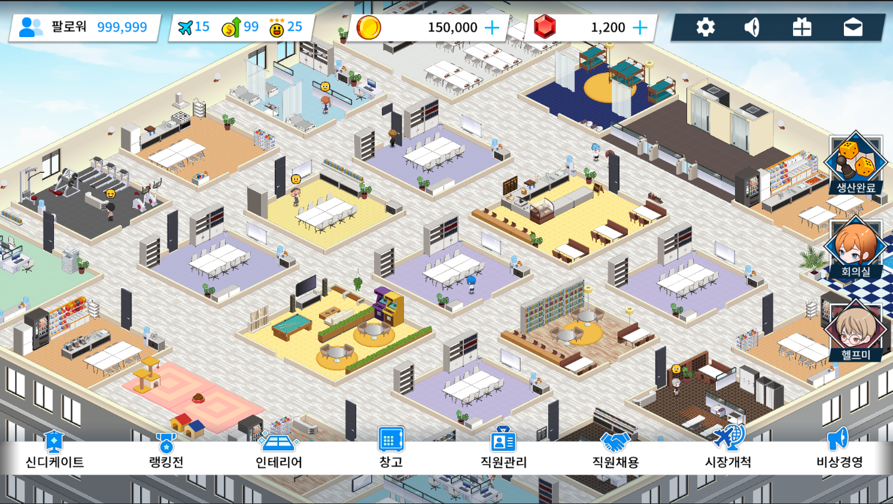
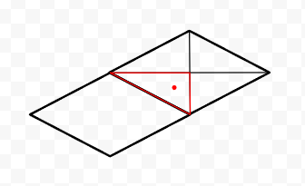
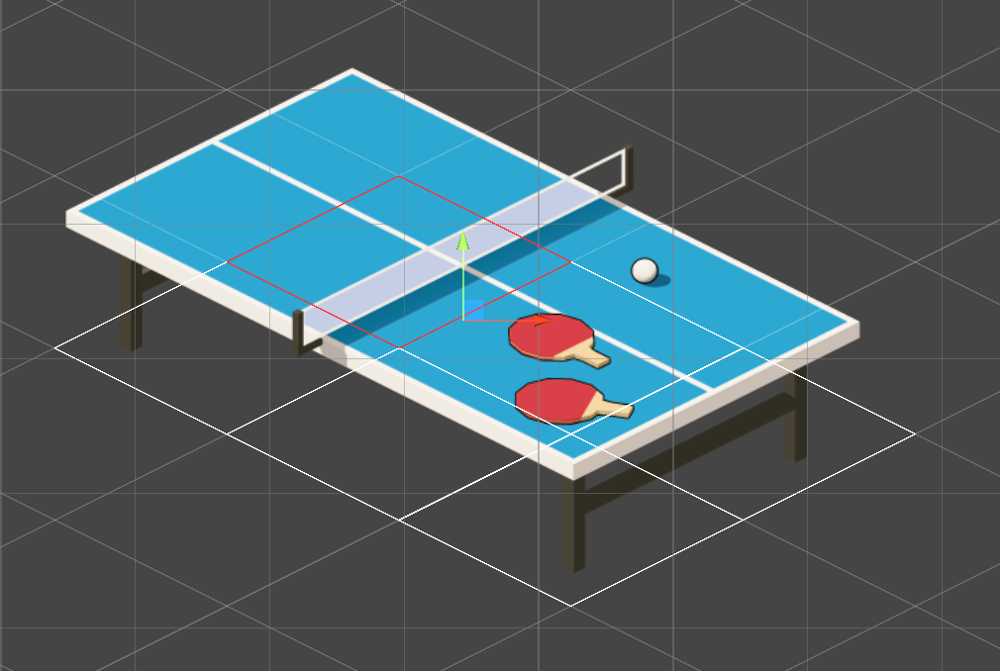
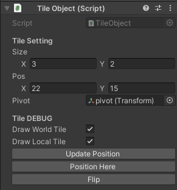
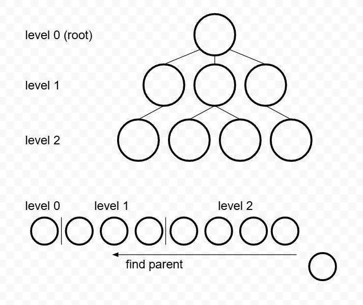

# My Little Company

## Project Overview

| **Screenshot** | **Information** |
| :--- | :--- |
|  | **Genre**   2D 경영 시뮬레이션    **Period**   2024.10 - 2025.10 (상업 프로젝트)    **Team**   10인 (클라 3, 서버 1, 기획 1, 아트 4, 사운드 1)    **Role**   로비 중심의 클라이언트 핵심 시스템 설계/구현 |

My Little Company는 시설 운영과 직원 관리 중심의 2D 경영 시뮬레이션입니다.  
플레이어는 게임의 핵심 플레이 공간인 로비에서 다양한 시설을 해금하고 직원을 관리하며 사무실을 확장해 나갑니다.  
시설을 통해 아이템을 생산하고 시장개척으로 재화를 확보하며, 자신만의 회사를 성장시킬 수 있습니다.  

## Technical Highlights

### 🏗️ Core System · Custom Isometric Engine

**Unity Tilemap의 다중 타일 정렬 문제를 해결하기 위해 설계한 Isometric 렌더링 시스템**

- 의존성 기반 트리 구조를 통해 전체 재정렬 없이 렌더링 순서를 관리.
- 3,600개 오브젝트 스트레스 테스트 환경에서 안정적인 60 FPS 유지.

<kbd>Mathematical Mapping</kbd> <kbd>Dependency Tree</kbd> <kbd>Spatial Re-parenting</kbd>

### 🤝 Collaboration Tool · YAML Scene Change Tracker

****Unity Scene YAML을 분석하여 오브젝트 단위 변경 추적과 충돌 검토를 지원하는 협업 도구****

- 오브젝트 단위 변경 검토를 통해 씬 병합 과정의 충돌 관리 효율 향상.
- 수정 내역 시각화를 통해 코드 리뷰 및 협업 생산성 개선.

<kbd>YAML Parsing</kbd> <kbd>Hierarchy Restoration</kbd> <kbd>Regex Matching</kbd> <kbd>Workflow Optimization</kbd>

## Key Contributions

### Gameplay & Runtime Systems

- ⭐ **Custom Isometric Engine**  
- Office Management — 아이템 생산, 직원 배치 등 데이터 기반의 사무실 운영 시스템 구현.
- Character Intelligence — A* 경로 탐색과 상태 표현 기반의 시간 제어 행동 시스템 구현.
- Environment Systems — URP Lighting 기반의 실시간 낮/밤 전환 시스템 구현.

### Development Workflow & Tools

- ⭐ **YAML Scene Change Tracker**  
- VCS Management — Git 기반 협업 환경에서 씬 충돌 관리 및 병합 프로세스 유지보수 담당.

---

## Custom Isometric Engine

### ⚠️ Limitations of Unity Tilemap (Why Custom System?)

Unity Tilemap의 Y-Sorting 방식은 단일 Pivot 값을 기준으로 렌더링 순서를 결정하기 때문에,  
N x M 크기를 점유하는 다중 타일 객체 환경에서는 정확한 렌더링 우선순위를 판별하지 못하는 구조적 한계가 존재합니다.  
특히 객체들이 복잡하게 배치될 경우 렌더링 순서가 뒤틀리거나 가려짐 관계가 역전되는 정렬 꼬임 현상이 발생합니다.  

이를 해결하기 위해 객체 간 공간적 선후 관계(Spatial Dependency)에 기반한 독자적인 정렬 시스템을 설계했습니다.

  

### 📐 Spatial Mapping Strategy

일반적인 역행렬-Round 방식은 부동소수점 오차로 인해 타일 경계에서 좌표가 튀는 지터링 현상을 유발합니다.  
특히 캐릭터 이동 시 타일 경계에서 미세한 오차로 인해 렌더링 순서가 깜빡이는 현상이 발생합니다.  
이에 타일 영역을 수학적으로 세분화하는 '삼각 영역 판별법'을 도입하여 수치적 안정성과 정밀도를 확보했습니다.

- 격자 세분화: 월드 공간을 half-tile 단위의 직교 그리드로 분할합니다.
- 영역 판정: 직선 방정식 `Ax + By + C > 0`을 활용하여 좌표가 속한 삼각형 영역을 판정합니다.
- 좌표 복원: 판정된 구역의 상대적 위치 정보를 기반으로 최종 타일 인덱스($x, y$)를 도출합니다.

  

### 🧱 Tile Entity System

TileObject는 타일 기반 환경에서 다양한 인게임 객체를 표현하기 위한 공통 엔티티입니다.  
다중 타일 점유와 Pivot 보정을 통해 Sprite와 논리 데이터 간의 정합성을 유지하며,  
격자 배치 및 Flip 기반 데이터 동기화 로직을 캡슐화하여 일관된 객체 제어 구조를 제공합니다.

직관적인 Isometric 오브젝트 배치를 위해 Custom Inspector와 Gizmos 기반의 시각적 디버깅 도구를 구축했습니다.  
점유 영역 시각화 및 One-Click Position Snap 기능을 통해 배치 작업의 정확성과 개발 생산성을 향상시켰습니다.

  
  

### 🌲 Render Ordering System: Dependency-Based OrderTree

OrderTree는 Unity Tilemap의 정렬 한계를 극복한 Isometric 렌더링 솔루션입니다.  
다중 타일 정렬 문제를 해결하기 위해 단순 값 비교 대신 공간적 선후 관계 기반 비교 알고리즘을 사용하며,  
의존성 기반 트리 구조를 통해 변경 영역만 국소 갱신하여, 대규모 객체 환경에서도 안정적인 렌더링 순서를 보장합니다.

#### System Preview

  

> 이 시각 자료는 OrderTree 기반 렌더링 시스템의 런타임 동작을 보여줍니다.  
> Y-sorting 기반 방식과 달리 공간 상태와 컨텍스트 변화에 따라 렌더링 순서가 동적으로 재구성됩니다.

- 캐릭터는 이동 경로에 따라 주변 오브젝트와의 관계에 의해 자연스럽게 가려지며 occlusion이 유지됩니다.
- 건물 진입 시 렌더링 컨텍스트가 외부 공간에서 내부 공간으로 전환됩니다.
- 내부 공간에서는 별도의 Local Ordering 규칙이 활성화되어 Level 기반 렌더링 계층으로 재구성됩니다.

### 🧮 CompareOrder: Relative Ordering Mechanism

CompareOrder는 의존성 트리 구성의 기본 단위로,  
두 객체의 Tile-Space 기반 Bounding Box를 기준으로 렌더링 순서를 판별하는 비교 연산입니다.  
객체의 최소 좌표(head)와 최대 좌표(tail)를 기준으로 CompareOrder(A, B)는 다음 값을 반환합니다.  

-  1 → A가 B보다 나중에 렌더링 되어야 함  
- -1 → B가 A보다 나중에 렌더링 되어야 함  
-  0 → 선후 관계를 정의할 수 없는 상태

선후 관계를 정의할 수 없는 상태(0)는 객체 간 독립 관계 또는 공간적 겹침으로 인해 발생합니다.  
특히 겹침으로 인해 발생한 경우에는 상위 오더 정책(Range / Context Layer)에서 최종 순서를 결정합니다.  

  

### 🌿 AddNode: Local Dependency Resolution

AddNode는 복잡한 오더 관계를 트리 구조로 근사(Tree Approximation)하는 핵심 삽입 알고리즘입니다.  
미리 정렬된 리스트를 탐색하여 가장 적절한 부모를 O(N) 비용으로 탐색하며, 다음과 같이 동작합니다.

- Parent Search: 계층적으로 정렬된 리스트를 역순으로 탐색하여 계층적으로 가장 근접한 노드를 부모로 선택합니다.
- Local Re-parenting: 리스트를 순회하여, 새 노드를 통해 의존 관계를 단순화할 수 있는 노드를 재부모화합니다.
- Hierarchical Propagation: 부모 노드를 기준으로 Level 및 Sorting Order를 재귀 전파하여 계층 데이터를 갱신합니다.

  

### 🌐 Runtime Ordering Context

- Order Range  
  CompareOrder로 판별되지 않는 겹침 관계는 range 기반 지역 오더로 처리됩니다.  
  캐릭터 경로 충돌이나 사무실 내부 오브젝트처럼 동일 영역에서 겹침이 발생하는 경우에 사용됩니다.  

- Cached Path  
  캐릭터와 같은 동적 객체는 이동마다 order를 재계산하지 않고, 경로(Path Node)의 order 정보를 캐싱하여 사용합니다.  
  이를 통해 이동 중 반복 연산을 제거하고 경로 기반 order를 재사용합니다.  

- Character Visit  
  캐릭터는 기본적으로 Cached Path 기반의 order를 사용하지만, 사무실 내부에 진입하면 내부 오더 규칙으로 전환됩니다.  
  내부 영역에서는 배경, 가구, 캐릭터로 구성된 계층 구조에 따라 레벨 단위로 렌더링 순서가 분리됩니다.  

### 📊 Performance Analysis: OrderTree vs. List.Sort

소규모 환경(34개 오브젝트)과 대규모 스트레스 테스트 환경(3,600개+ 오브젝트)에서 두 방식의 실행 속도를 비교한 결과입니다.

| Metric | List.Sort (34) | OrderTree.AddNode (34) | List.Sort (3600+) | OrderTree.AddNode (3600+) |
| :--- | :--- | :--- | :--- | :--- |
| 평균 실행시간 | 0.169 ms | 0.04 ms | 6,593.0 ms | 0.086 ms |
| 최대 실행시간 | - | 1.1687 ms | - | 1.3451 ms |
| 최소 실행시간 | - | 0.0016 ms | - | 0.0008 ms |

- Experiment Setup  
  List.Sort는 모든 오브젝트가 존재하는 상태에서 전체 정렬을 수행하는 방식으로 측정했습니다.  
  OrderTree.AddNode는 빈 상태에서 오브젝트를 순차적으로 추가하며 트리를 구성하는 방식으로 측정했습니다.  

- Result Summary  
  소규모 환경에서는 List.Sort가 더 빠르지만, 대규모 환경에서는 OrderTree.AddNode가 더 높은 성능을 보입니다.  
  객체 수가 증가할수록 두 방식의 성능 격차는 크게 확대됩니다.

- Runtime Characteristics  
  List.Sort는 변경 시마다 전체 정렬을 수행하는 반면, AddNode는 단일 삽입 비용만 발생합니다.  
  이로 인해 변경 횟수가 증가할수록 성능 격차가 크게 확대됩니다.  

---

## YAML Scene Change Tracker

Unity Scene을 YAML 구조 기반으로 분석하여, Scene 간 변경 사항을 구조적으로 추적하는 도구입니다.  
GameObject 및 Component 단위로 Scene을 분해하고, 계층 구조를 복원한 뒤 Diff 기반으로 변경을 검출합니다.

### 🧩 Scene Structure Extraction

Unity Scene YAML을 파싱하여 GameObject와 Component 단위의 구조 데이터로 변환합니다.  
Prefab 인스턴스를 포함한 계층 관계를 복원하여 Scene의 구조적 표현을 생성합니다.

- Scene YAML → structured object graph 변환
- GameObject / Component 단위 분해
- Prefab instance 포함 계층 구조 구성

### 🔍 Scene Diff Detection

기존 Scene과 새로운 Scene을 비교하여 변경된 요소를 탐지합니다.  
GameObject 및 Component 단위로 Add / Remove / Modify 상태를 판별합니다.

- Origin Scene vs New Scene 비교
- GameObject / Component 변경 감지
- Add / Remove / Modify 분류 기반 Diff 처리

---

## System Demo

구현된 핵심 시스템의 동작을 확인할 수 있는 Android 데모 빌드입니다.

- 플랫폼: Android  
- 목적: 시스템 구조 및 렌더링 동작 검증  
- 포함 기능: 타일 배치, Isometric 오더링, 캐릭터 이동 및 렌더링 정렬

[Demo APK 다운로드 (v1.0)](https://github.com/javaCof/MyLittleCompany/releases/tag/mlc-v1.0)

## Notes for Reviewers

- 본 레포지토리는 완성된 게임이 아닌 핵심 시스템 중심의 기술 포트폴리오입니다.  
- 구현 결과보다 설계 과정, 문제 해결 방식, 시스템 구조에 중점을 두었습니다.  
- 일부 콘텐츠 및 리소스는 핵심 로직 설명을 위해 단순화되어 있습니다.

## Appendix

<strong>📚 Architectural Evolution : 알고리즘 발전 과정 및 시행착오</strong>

- 초기 시도. 전수 조사 정렬 (Brute-force)  
  🟦 매 프레임 모든 객체 간의 전후 관계를 전수 조사하여 정렬을 수행했습니다.  
  🟥 객체 수 증가에 따라 연산량이 급격히 증가하며 심각한 프레임 드랍이 발생했습니다.

- 1차 개선. 조건적 전수 조사 정렬 (Incremental Brute-force)  
  🟦 오브젝트 변경(추가/이동/삭제)이 발생했을 때만 전수 조사를 수행하도록 개선했습니다.  
  🟥 정적 상태의 연산은 줄었지만, 정렬 실행 시 발생하는 병목 현상은 해결하지 못했습니다.

- 2차 개선. 관계 기반 그래프 구조 정렬 (Explicit Dependency DAG)  
  🟦 객체를 노드화하여 부모-자식 관계를 가지는 방향성 비순환 그래프(DAG) 구조를 도입했습니다.  
  🟥 간접 의존 노드까지 모두 연결되며 중복 오더 전파 문제가 발생했습니다.

- 3차 개선. 전이적 축소 기반 그래프 최적화 (Transitive Reduction DAG)  
  🟦 노드 추가 시 하위 경로를 검사하여 간접 의존 노드를 제거하는 전이적 축소 알고리즘을 도입했습니다.  
  🟥 오더 전파는 크게 감소했지만, 모든 자식 노드를 검사하는 구조 갱신 비용이 남아있었습니다.

- 최종 진화. 정렬을 내포한 계층적 구조 (OrderTree)  
  🟦 그래프 구조를 트리 구조로 근사(Tree-approximated DAG)하여 문제를 단순화했습니다.  
  🟩 노드 변경 시, 계층적으로 정렬된 리스트 내부에서 부모를 탐색하도록 구조를 재설계했습니다.  
  🟩 전체 그래프 재구성 없이도 안정적인 렌더링 순서 유지가 가능해졌습니다.

## Contact

- Email: javacoffee0930@gmail.com
