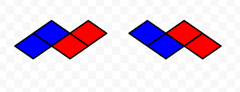
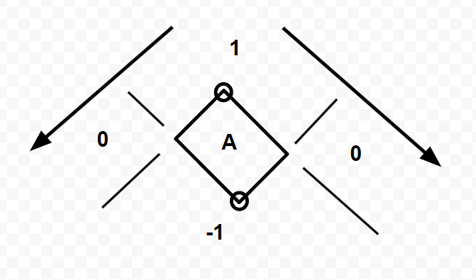

# Tile System & Render Ordering

## Overview

This document describes the design and implementation of the tile-based spatial system and rendering order resolution used in **My Little Company**.

The system was built to solve two core problems:
- Converting between world space and tile space in an isometric grid
- Determining correct rendering order for tile-based objects

## Why Not Unity Tilemap?

This project required precise control over multi-tile objects and rendering order.

**Key limitations:**
- Partial occlusion issues for multi-tile objects
- Limited runtime control over complex depth relationships

→ A custom tile system was implemented to ensure deterministic spatial logic.

## Coordinate Conversion & Precision Strategy

### 1. World → Tile Projection
The isometric grid in this system is defined by two primary axes:
* **X-axis:** Down-right direction.
* **Y-axis:** Down-left direction.

Initially, world positions are projected into tile space using an inverse transformation to produce floating-point coordinates. However, to ensure rendering integrity, a more robust detection method was implemented.

### 2. Triangle-Based Region Discrimination
While a simple `Round` strategy is efficient, it often leads to numerical instability near tile boundaries. To solve this, the system employs **Region-based Discrimination** (Triangle-based classification).

#### **The Algorithm**
Instead of direct rounding, the conversion logic (`PosToTilexy`) follows these steps:
1. **Grid Sub-division:** Divides the world space into a rectangular grid unit (half the width/height of a tile).
2. **Edge Equation:** Uses a linear equation `(Ax + By < C)` to determine which triangular half of the grid the point occupies.
3. **Coordinate Remapping:** Reconstructs the final `(X, Y)` tile index based on the identified region.

  

#### **Why This Matters**
* **Deterministic Boundaries:** Eliminates "tile-jumping" or flickering that occurs when an object is exactly on a diamond's edge.
* **Occlusion Integrity:** Provides stable input for the `OrderTree` system, ensuring that multi-tile objects are sorted with 100% consistency.
* **Numerical Stability:** Minimizes the impact of floating-point drifting compared to standard rounding.

### 3. Comparison Summary

| Feature | Inverse Formula + Rounding | Region-based (Implemented) |
| :--- | :--- | :--- |
| **Logic** | Matrix Inverse & Rounding | Linear Edge Equations |
| **Precision** | Medium (Boundary Jitter) | High (Deterministic) |
| **Stability** | Requires Epsilon Padding | Inherently Stable |
| **Use Case** | Simple Prototypes | Complex Occlusion Systems |

> **Final Implementation Note:** The Region-based method was chosen to guarantee the visual accuracy required for complex tile-based interactions and multi-layered rendering.

## Render Ordering Problem

In an isometric view, objects must be rendered in the correct order to maintain visual depth.

A naive approach such as sorting a list of objects is insufficient because:

- Rendering order is not strictly linear  
- Objects may have partial spatial relationships  
- Some objects cannot be strictly ordered  

  

## OrderTree: Dependency-Based Ordering

To solve this, rendering order is treated as a dependency graph problem.

### Core Idea

Instead of sorting objects directly:

- Each object is treated as a node  
- Nodes are connected based on spatial relationships  
- Rendering order is derived from the graph structure  

### Node Relationship

Each node represents a tile-space bounding box:

- `head`: minimum coordinate  
- `tail`: maximum coordinate  

`CompareOrder(A, B)` determines:

- `1` → A should be rendered after B  
- `-1` → A should be rendered before B  
- `0` → no strict relationship (independent or ambiguous)  

  

This comparison is based on relative tile positions, assuming most objects do not overlap.

### AddNode: Local Dependency Resolution

When a node is inserted:

1. **Parent Discovery**  
   - Finds the closest node that must be rendered before the new node  

2. **Reparenting**  
   - If the new node should be rendered before existing nodes,  
     those nodes are reattached as its children  

3. **Propagation**  
   - Order values are updated only within the affected sub-tree  

  

This avoids full re-sorting and keeps updates localized.

## Order Propagation

Once inserted into the tree:

- Each node inherits order from its parent  
- Order increases by `range` per level  
`child.order = parent.order + range`

This ensures stable and hierarchical ordering across dependent nodes.

## Handling Overlap: Order Range

`OrderTree` assumes that most objects can be ordered through clear spatial relationships.  
However, additional handling is required when multiple objects share the same tile space.

The `range` value is used to resolve these cases without modifying the tree structure.

### 1. Multiple Objects at the Same Position

For dynamic entities such as characters,  
ordering is not assigned directly to the objects themselves.

Instead:

- Order is assigned to the **path coordinate** (cached path node)  
- Characters inherit their order from the path  

Within a single path node:

- Multiple characters may exist simultaneously  
- Ordering is resolved using the node’s `range`  
`order + 0, order + 1, ..., order + (range - 1)`

This ensures:

- Stable ordering for moving objects  
- Deterministic rendering without per-frame tree updates  

### 2. Containment / Attached Objects

For objects that contain or manage internal elements:

- The parent node is responsible for ordering its child objects  
- `range` is used to assign sub-orders within the parent  

Since child objects must be rendered after the parent:

- Ordering starts from an offset (`+1`)

This guarantees:

- Parent is rendered first  
- Child objects are rendered on top  
- Consistent grouping without introducing additional dependencies  

### Summary

The system avoids resolving all cases through structural changes.

- Clear spatial relationships are handled by the tree  
- Overlapping cases are resolved locally using `range`  

This minimizes graph updates while maintaining stable and predictable rendering behavior.

## Performance Analysis: OrderTree vs. List.Sort

The following comparison shows performance differences across two scales:
a small scene (**34 objects**) and a large scene (**3,600+ objects**).

### Comparison

| Metric | 34 Objects (List.Sort) | 34 Objects (OrderTree AddNode) | 3600+ Objects (List.Sort) | 3600+ Objects (OrderTree AddNode) |
| :--- | :--- | :--- | :--- | :--- |
| Avg. Execution Time | 0.169 ms | 0.04 ms | 6593.0 ms | 0.086 ms |
| Max Execution Time | - | 1.1687 ms | - | 1.3451 ms |
| Min Execution Time | - | 0.0016 ms | - | 0.0008 ms |
| Update Scope | Global | Local | Global | Local |

### Complexity & Runtime Impact

- **List.Sort**  
  - Time Complexity: O(N log N)  
  - Requires full re-sorting of all objects  
  - Execution time increases significantly as object count grows  
  - May cause frame drops in large scenes  

- **OrderTree**  
  - Time Complexity: O(tree depth) ≈ O(log N)  
  - Updates only a localized sub-tree  
  - Performance remains stable regardless of total object count  
  - Suitable for real-time updates, maintaining stable 60 FPS gameplay  

### Summary

At small scales, both approaches perform adequately.  
However, as the number of objects increases, the cost of global sorting becomes prohibitive.

By updating only local dependencies,  
`OrderTree` maintains stable performance and avoids frame drops in large, dynamic isometric scenes.

This approach enables consistent and scalable rendering behavior without relying on global sorting.